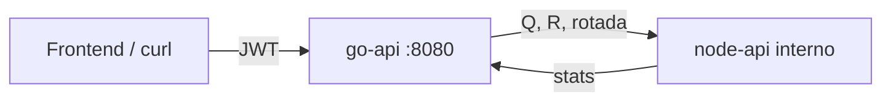

# matrix-qr-apis

Go (Fiber v3) recibe una matriz, la rota 90° horaria y calcula su QR. Node (Express 5) devuelve estadísticas. El cliente solo habla con Go.



## Decisiones sobre el enunciado

El enunciado mezcla **rotar** y **QR**. Se hacen las dos sobre la matriz original `A`:

- `rotated` = `A` girada 90° horaria
- `Q`, `R` = QR de `A` (no de la rotada), para que `Q × R ≈ A`

QR con **Householder** (más estable que Gram-Schmidt). Forma thin:

- `m ≥ n` → `Q` m×n, `R` n×n
- `m < n` → `Q` m×m, `R` m×n

Node recorre **Q + R + rotada** (max, min, promedio, suma) y marca si cada una es diagonal (`ε = 1e-9`; no cuadrada ⇒ no diagonal).

Límites: matriz no vacía, rectangular, números finitos, máximo **50×50**. JWT HS256 en Go; Node no autentica (red interna).

## Cómo ejecutar localmente

Requisitos: Go 1.26, Node 24, Docker. Demo JWT: **`admin` / `admin`**.

**Local** — tres terminales:

```bash
cd node-api && npm install && npm start
cd go-api && go run ./cmd/server
cd frontend && npm install && npm run dev
```

UI: http://localhost:5173 (Vite → Go `:8080`).

**Docker**

```bash
docker compose up --build
```

UI: http://localhost:8081 · API: http://localhost:8080 · Node no se publica.

## Deploy (Railway)

- UI: https://matrix-qr-production.up.railway.app
- API Go: https://go-api-production-5bd7.up.railway.app
- Node: red privada (sin URL pública). El cliente no lo usa.

Demo JWT: **`admin` / `admin`**.

```bash
TOKEN=$(curl -s -X POST https://go-api-production-5bd7.up.railway.app/auth/login \
  -H "Content-Type: application/json" \
  -d "{\"username\":\"admin\",\"password\":\"admin\"}" | sed -n 's/.*"token":"\([^"]*\)".*/\1/p')

curl -s -X POST https://go-api-production-5bd7.up.railway.app/api/v1/matrix \
  -H "Content-Type: application/json" \
  -H "Authorization: Bearer $TOKEN" \
  -d "{\"matrix\":[[1,2],[3,4],[5,6]]}"
```

## API

Públicos: `GET /health`, `POST /auth/login`. Protegido: `POST /api/v1/matrix`.

```bash
TOKEN=$(curl -s -X POST http://localhost:8080/auth/login \
  -H "Content-Type: application/json" \
  -d "{\"username\":\"admin\",\"password\":\"admin\"}" | sed -n 's/.*"token":"\([^"]*\)".*/\1/p')

curl -s -X POST http://localhost:8080/api/v1/matrix \
  -H "Content-Type: application/json" \
  -H "Authorization: Bearer $TOKEN" \
  -d "{\"matrix\":[[1,2],[3,4],[5,6]]}"
```

Login: `{ "username", "password" }` → `{ "token", "expires_in" }`.

Matrix: `{ "matrix": [[...]] }` → `original`, `rotated`, `qr.q`, `qr.r`, `stats`.

Errores: `400` validación · `401` JWT · `502` Node caído.

Variables: `.env.example` (`PORT`, `NODE_API_URL`, `JWT_*`, `CORS_ORIGINS`).

## Tests

```bash
cd go-api && go test ./...
cd node-api && npm test
```

`go test ./... -short` omite la integración Go→Node.
